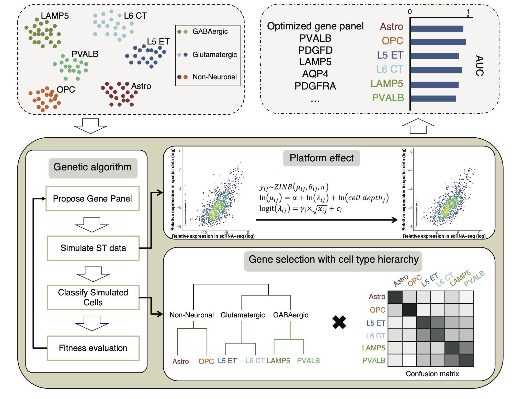

[](https://app.circleci.com/pipelines/github/kharchenkolab/gpsFISH)

# gpsFISH
- [Introduction](#introduction)
- [Installation](#installation)
- [Tutorials](#tutorials)
  * [Platform effect estimation](#platform-effect-estimation)
  * [Gene panel selection](#gene-panel-selection)
- [Citation](#citation)


## Introduction
Methods for targeted spatial transcriptomic analysis hold particular promise in analysis of complex tissues. Most such methods, however, measure only a limited panel of transcripts, which need to be selected in advance to inform on the cell types or processes being studied.  

Here we describe gpsFISH, a computational method to perform such selection in a way that optimizes detection of previously annotated cell types or cell type hierarchies. We show systematic difference of transcript detection rates between different technologies, which distorts the resulting transcriptional profile estimates. Such distortions reduce the resulting ability to distinguish cell types in the targeted spatial transcriptomics data relative to what would be expected from scRNA-seq data. gpsFISH was designed to model and adjust for the platform effects, yielding more informative gene panels and better cell type classification. In addition, gpsFISH can incorporate the hierarchical structure of cell types to better account for complex cell type relationships. Finally, we observed a high redundancy of gene panels, and extended gpsFISH to incorporate custom gene preferences. Overall, gpsFISH outperforms other gene selection methods, improving support for hierarchical cell classification as well as flexible options to accommodate diverse design requirements.



## Installation
To use gpsFISH from GitHub, install with the following:

``` r
install.packages('devtools')
devtools::install_github("kharchenkolab/gpsFISH")
```

To install the development version (faster version) of gpsFISH:

``` r
install.packages('devtools')
devtools::install_github(repo = 'kharchenkolab/gpsFISH', ref = 'devel')
```

#### System dependencies

GSL libraries need to be installed to use the development version. It is inherited from `Rfast`. 

##### Ubuntu dependencies

To install system dependencies using `apt-get`, use the following:
```sh
sudo apt-get install libgsl-dev
```

##### Red Hat-based distributions dependencies

For Red Hat distributions using `yum`, use the following command:

```sh
sudo yum -y install gsl
```

##### Mac OS

Using the Mac OS package manager [Homebrew](https://brew.sh/), try the following command:

```sh
brew install gsl
```


## Tutorials

Please see the following tutorials for detailed examples of how to use gpsFISH: 

### Platform effect estimation:

* [HTML version](https://htmlpreview.github.io/?https://github.com/kharchenkolab/gpsFISH/blob/devel/doc/simulation_training.html)
* [Markdown version](https://github.com/kharchenkolab/gpsFISH/blob/devel/doc/simulation_training.md)

### Gene panel selection:
* [HTML version](https://htmlpreview.github.io/?https://github.com/kharchenkolab/gpsFISH/blob/devel/doc/gene_panel_selection.html)
* [Markdown version](https://github.com/kharchenkolab/gpsFISH/blob/devel/doc/gene_panel_selection.md)


## Citation

If you find gpsFISH useful for your publication, please cite:

[Yida	Zhang, Viktor	Petukhov, Evan Biederstedt, Richard	Que, Kun Zhang, Peter V. Kharchenko (2024). Gene	panel	selection	for	targeted spatial transcriptomics.        Genome Biology 2024.](https://genomebiology.biomedcentral.com/articles/10.1186/s13059-024-03174-1)

