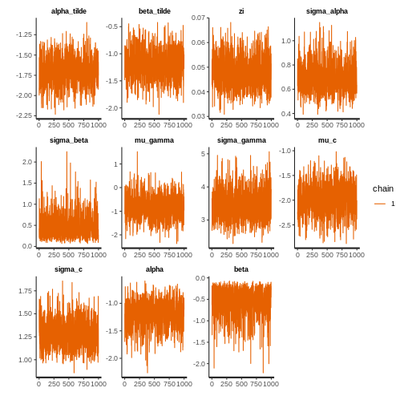
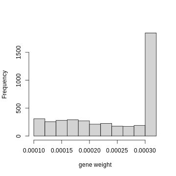
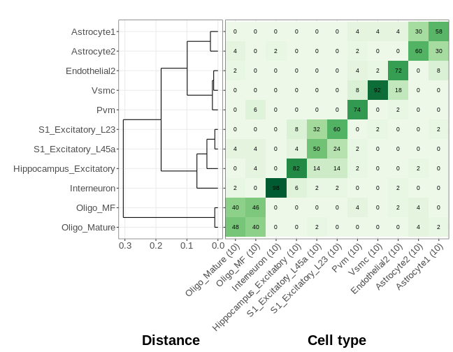
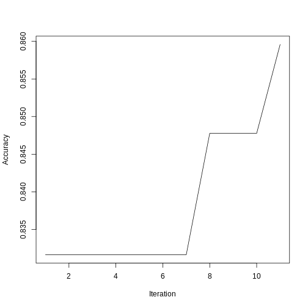
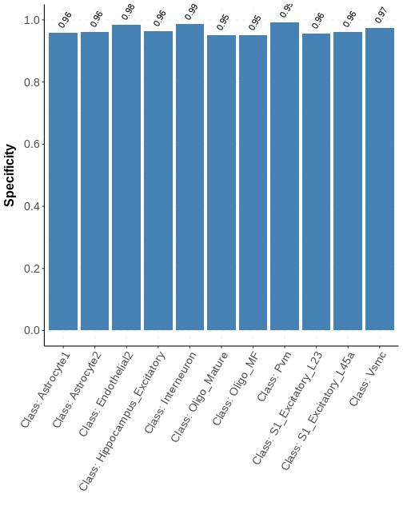
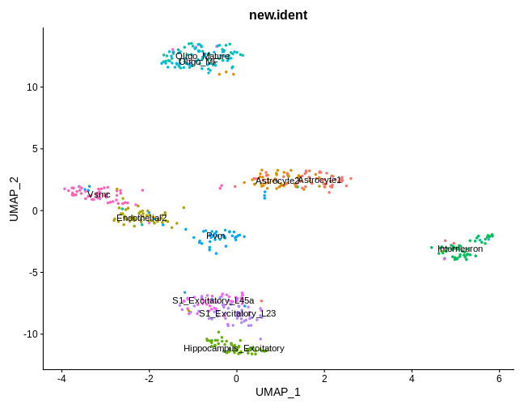

- [Load the data](#load-the-data)
- [Prepare input](#prepare-input)
  * [Relative expression](#relative-expression)
  * [Filter genes](#filter-genes)
  * [Construct weighted penalty matrix based on cell type hierarchy](#construct-weighted-penalty-matrix-based-on-cell-type-hierarchy)
  * [Generate gene weight](#generate-gene-weight)
  * [Initialize population for gene panel selection](#initialize-population-for-gene-panel-selection)
- [Gene panel selection](#gene-panel-selection)
- [Inspect gene panel selection result](#inspect-gene-panel-selection-result)
  * [Get the genes in the gene panel](#get-the-genes-in-the-gene-panel)
  * [Average expression per cell type for selected genes](#average-expression-per-cell-type-for-selected-genes)
  * [Plot confusion matrix](#plot-confusion-matrix)
  * [Get the final population](#get-the-final-population)
  * [Fitness change during optimization](#fitness-change-during-optimization)
  * [Check classification statistics](#check-classification-statistics)
  * [Clustering based on selected gene panel](#clustering-based-on-selected-gene-panel)
- [Session Info](#session-info)

In this tutorial, we will demonstrate how to perform gene panel selection for 
hm-smFISH-based spatially resolved transcriptomics using scRNA-seq data. 

First, let’s load libraries:


```r
library(gpsFISH)
library(data.table)    
#> data.table 1.14.0 using 64 threads (see ?getDTthreads).  Latest news: r-datatable.com
library(pagoda2)      
#> Loading required package: Matrix
#> Loading required package: igraph
#> 
#> Attaching package: 'igraph'
#> The following objects are masked from 'package:stats':
#> 
#>     decompose, spectrum
#> The following object is masked from 'package:base':
#> 
#>     union
library(parallel)      
library(ranger)       
library(caret)       
#> Loading required package: lattice
#> Loading required package: ggplot2
library(pROC)        
#> Type 'citation("pROC")' for a citation.
#> 
#> Attaching package: 'pROC'
#> The following objects are masked from 'package:stats':
#> 
#>     cov, smooth, var
library(naivebayes)    
#> naivebayes 0.9.7 loaded
#> 
#> Attaching package: 'naivebayes'
#> The following object is masked from 'package:data.table':
#> 
#>     tables
library(splitTools)   
library(boot)  
#> 
#> Attaching package: 'boot'
#> The following object is masked from 'package:lattice':
#> 
#>     melanoma

#optional packages for generating plots
library(pheatmap)     
library(ggplot2)      
library(reshape2)     
#> 
#> Attaching package: 'reshape2'
#> The following objects are masked from 'package:data.table':
#> 
#>     dcast, melt
library(Seurat)       
#> Attaching SeuratObject
library(ggdendro)     
library(dplyr)       
#> 
#> Attaching package: 'dplyr'
#> The following objects are masked from 'package:igraph':
#> 
#>     as_data_frame, groups, union
#> The following objects are masked from 'package:data.table':
#> 
#>     between, first, last
#> The following objects are masked from 'package:stats':
#> 
#>     filter, lag
#> The following objects are masked from 'package:base':
#> 
#>     intersect, setdiff, setequal, union
library(cowplot)    
```

## Load the data

Next we will load the example datasets needed for gene panel selection: 


```r
data(sc_count)            #raw count expression matrix
data(sc_cluster)          #cell type annotation
rownames(sc_count) = toupper(rownames(sc_count))

data(simulation_params)   #pre-trained simulation model. To reduce its size, we have set the "data2fit" and "model.summary" slot to NA. Information in these two slots will not be used and therefore, will not affect the gene panel selection.

#Optional information for additional features. Gene panel selection can be performed without them.
data(probe_count)         #probe count per gene
rownames(probe_count)=make.unique(as.character(probe_count$gene_name))

gene2include.symbol = toupper(c("Gad1", "Gad2", "Slc32a1", #curated marker genes must be included during gene panel selection
                                "Crhbp", "Cnr1", "Vip"))   

data(cell_type_hierarchy) #cell type hierarchy
```

## Prepare input

Here, we prepare input for gene panel selection based on the loaded datasets. 

### Relative expression
First, we calculate relative expression for each gene. 
This is the key input for simulating spatial transcriptomics measurement from scRNA-seq data.
To make relative expression consistent across datasets, 
we calculate it based on all genes in the transcriptome before gene filters.


```r
unique_cluster_label=as.character(unique(sc_cluster$class_label))      #unique cell type labels

#cluster-wise relative expression
relative_prop = list()
relative_prop[["cluster.average"]] = sapply(unique_cluster_label, gene_list=rownames(sc_count), relative_freq,
                                          count_matrix=sc_count,             
                                          cell_cluster_conversion=sc_cluster)
#individual cell level relative expression
relative_prop[["cell.level"]] = t(t(sc_count)/colSums(sc_count))
```

### Filter genes
Then, we filter out genes with low expression. 
Specifically, we filter out lowly expressed genes based on their average expression in the highest expressed cell type. 
This way, if a gene in only highly expressed in a rare cell type, we will keep it instead of removing it.


```r
ave_count_ik_all_gene = sapply(unique_cluster_label, gene_list = rownames(sc_count), average_count,
                               count_matrix = sc_count,               
                               cell_cluster_conversion = sc_cluster)
maxexpr = apply(ave_count_ik_all_gene, 1, max)     #average expression in the highest expressed cell type for each gene

#check the distribution of maxexpr
hist(log10(maxexpr), col="gray", xlab="log10(max cluster average expression)", main = "")
```


```r

#keep genes with maxexpr >= 1
gene2keep = rownames(sc_count)[which(maxexpr>=1)]
```

We also filter out unannotated genes and lncRNA.

```r
#remove genes with . in their gene symbol
gene2remove1 = grep("\\.", gene2keep)
#remove lncRNAs (genes with -AS in their gene symbol)
gene2remove2 = grep("-AS", gene2keep)
if (length(union(gene2remove1, gene2remove2))>0){
  gene2keep = gene2keep[-union(gene2remove1, gene2remove2)]
}
```

If we have information about the number of probes we can design to target each gene,
it is suggested to filter out genes with small number of probes. 
Here we filter out genes with fewer than 5 probes.


```r
genes.pass.probe.filter = rownames(subset(probe_count, probe_count>=5))
gene2keep = intersect(gene2keep, genes.pass.probe.filter)
```

Some of the curated marker genes may be filtered out in this process. 
Given the biological question, you may want to put them back although 
they didn't meet the criterion. 


```r
gene2keep = union(gene2keep, gene2include.symbol)
cat(length(gene2keep), "genes pass the filters and will be used for gene panel selection")
#> 4229 genes pass the filters and will be used for gene panel selection
```

Subset the datasets based on genes passing all the filters:

```r
sc_count = sc_count[gene2keep, ]
relative_prop$cluster.average = relative_prop$cluster.average[gene2keep, ]
relative_prop$cell.level = relative_prop$cell.level[gene2keep, ]

gene2include.id = which(rownames(sc_count) %in% gene2include.symbol)   #in the gene panel selection, genes will be encoded by their position in the gene list. Therefore, we need to get the position of curated marker genes here.
gene2include.symbol = rownames(sc_count)[gene2include.id]
```

### Construct weighted penalty matrix based on cell type hierarchy
In the default mode, all the correct classifications and misclassifications are treated equally.
However, there can be situations where certain types of misclassifications are more tolerable than others. 
To accound for this custom preference,
our algorithm provides an option to specify partial credit or extra penalty to classifications between certain cell types. 
In order to do so, a weighted penalty matrix needs to be specified.
In general, it can be constructed arbitrarily based on users need. 
Here in this example, we construct the weighted penalty matrix based on cell type hierarchy.

First, we calculate distance between cell types:


```r
cluster_distance=cluster_dis(count_table = sc_count,                       
                            cell_cluster_conversion = sc_cluster,
                            cluster_metric = "complete",
                            dist_metric = "correlation",
                            log.transform = F,                                 
                            top.var.gene = 1000)

#Dendrogram of clusters
plot(cluster_distance$hierarchy, hang = -1)      
```


Then we can construct a raw weighted penalty matrix based on the cell type distance.


```r
raw_weight_penalty = as.matrix(cluster_distance$distance_matrix)
raw_weight_penalty = raw_weight_penalty/max(raw_weight_penalty)     #normalize the value to make sure it is between 0 and 1
```

We can use this matrix as the weighted penalty matrix if we don't have cell type hierarchy. 
However, if we have cell type hierarchy, i.e., cell type annotation at different levels of granularity, 
we can specify a level as reference and adjust the raw weighted penalty matrix accordingly.
Specifically, for two cell types that don't belong to the same cell type at the reference level, 
misclassifications between them will receive extra penalty.
On the contrary, for two cell types that belong to the same cell type at the reference level,
misclassifications between them will receive partial credit proportional to their distance based on expression,
i.e., more partial credit will be given to more similar cell types. 
Since we have the cell type hierarchy information, we can adjust the raw weighted penalty matrix:


```r
weight_penalty = hierarchical_penalty(weight.matrix = raw_weight_penalty, cell.type.hierarchy = cell_type_hierarchy,
                                      reference.resolution = "class", current.resolution = "subclass", penalty = 2)

#change the diagonal value to 1. This is to make sure that correct predictions will stay unchanged
diag(weight_penalty)=1
weight_penalty
#>                        Interneuron S1_Excitatory_L45a S1_Excitatory_L23 Hippocampus_Excitatory Oligo_Mature   Oligo_MF
#> Interneuron                      1         2.00000000        2.00000000             2.00000000   2.00000000 2.00000000
#> S1_Excitatory_L45a               2         1.00000000        0.03280485             0.11655514   2.00000000 2.00000000
#> S1_Excitatory_L23                2         0.03280485        1.00000000             0.08640677   2.00000000 2.00000000
#> Hippocampus_Excitatory           2         0.11655514        0.08640677             1.00000000   2.00000000 2.00000000
#> Oligo_Mature                     2         2.00000000        2.00000000             2.00000000   1.00000000 0.03333612
#> Oligo_MF                         2         2.00000000        2.00000000             2.00000000   0.03333612 1.00000000
#> Pvm                              2         2.00000000        2.00000000             2.00000000   0.49578157 0.71547011
#> Vsmc                             2         2.00000000        2.00000000             2.00000000   0.47298311 0.69181743
#> Endothelial2                     2         2.00000000        2.00000000             2.00000000   0.54079928 0.76849017
#> Astrocyte2                       2         2.00000000        2.00000000             2.00000000   0.49729523 0.69685750
#> Astrocyte1                       2         2.00000000        2.00000000             2.00000000   0.74782313 0.95550207
#>                               Pvm       Vsmc Endothelial2 Astrocyte2 Astrocyte1
#> Interneuron            2.00000000 2.00000000   2.00000000 2.00000000 2.00000000
#> S1_Excitatory_L45a     2.00000000 2.00000000   2.00000000 2.00000000 2.00000000
#> S1_Excitatory_L23      2.00000000 2.00000000   2.00000000 2.00000000 2.00000000
#> Hippocampus_Excitatory 2.00000000 2.00000000   2.00000000 2.00000000 2.00000000
#> Oligo_Mature           0.49578157 0.47298311   0.54079928 0.49729523 0.74782313
#> Oligo_MF               0.71547011 0.69181743   0.76849017 0.69685750 0.95550207
#> Pvm                    1.00000000 0.04495902   0.05825841 0.14602916 0.32128127
#> Vsmc                   0.04495902 1.00000000   0.04492468 0.10530401 0.25959643
#> Endothelial2           0.05825841 0.04492468   1.00000000 0.16475047 0.32448244
#> Astrocyte2             0.14602916 0.10530401   0.16475047 1.00000000 0.07929015
#> Astrocyte1             0.32128127 0.25959643   0.32448244 0.07929015 1.00000000
```

### Generate gene weight
Another option we provide is gene weight. In the default mode, all the genes are treated equally.
However, in certain cases, genes with certain features are preferred.
For example, genes with more probes could potentially lead to more robust signal and higher sensitivity.
Therefore, in this example, we generate gene weight based on the number of probes that can 
be designed to target each gene. By incorporating this information into gene panel selection,
genes with more probes will be preferred during the optimization.


```r
gene.weight = probe_count[, c("gene_name", "probe_count")]
colnames(gene.weight) = c("gene", "weight")

#one gene could show up as multiple rows
#In this case, we choose the highest probe count as its weight
gene.weight = data.table::as.data.table(gene.weight)
gene.weight = gene.weight[gene.weight[, .I[which.max(weight)], by=gene]$V1]     
gene.weight = as.data.frame(gene.weight)
rownames(gene.weight) = gene.weight$gene

#Distribution of probe count
hist(gene.weight$weight, xlab = "number of probe count per gene", main = "")
```



```r

#we censor the probe count at 15 to avoid bias towards genes with extremely high probe count
gene.weight[gene.weight$weight>15, "weight"] = 15

#convert it to the gene weight format: 
#A data frame. Each row is one gene and its weight. The weight of all genes sum up to 1. Genes with higher weight are more likely to be included in the panel)
gene.list = rownames(sc_count)
weight.list = rep(NA, length(gene.list))
names(weight.list) = gene.list
overlap.gene = intersect(gene.list, gene.weight$gene)
weight.list[overlap.gene] = gene.weight[overlap.gene, "weight"]
weight.list = weight.list/sum(weight.list)

gene.weight=data.frame(gene=gene.list, weight=weight.list)

#Distribution of final gene weight
hist(gene.weight$weight, xlab = "gene weight", main = "")
```



### Initialize population for gene panel selection
An initial population is needed for gene panel selection using the genetic algorithm.
If not provided, the algorithm will initialize the population randomly.
However, to make the optimization more efficient, we can include differentially expressed genes (DEGs)
between cell types into the initial population.
Here, we initialize some panels using DEGs and some panels using randomly selected genes to maintain diversity.


```r
#Calculate DEGs for each cell type
adjust_variance=preprocess_normalize(sc_count, n.core=2)
#> 550 cells, 4229 genes; normalizing ...
#> Using plain model
#> log scale ...
#> done.
#> calculating variance fit ...
#>  using gam
#> 529 overdispersed genes ... 529
#> persisting ...
#> done.
diff_expr=suppressMessages(diff_gene_cluster(pagoda_object = adjust_variance$pagoda.object, cell_cluster_conversion = sc_cluster, n.core = 1))     
diff_expr_result = diff_expr$diff_result

#statistics for the population
pop_size = 100          #population size: number of gene panels in a population
panel_size = 100        #panel size: number of genes in a gene panel
num.random.panel = 95   #number of panels that we initialize randomly
num.DE.panel = pop_size-num.random.panel    #number of panels initialized using DEGs

#initialize panels with DEGs
set.seed(11111)
initpop.DE=initialize_population(pop.size = num.DE.panel, panel.size = panel_size,
                                 diff_expr_result = diff_expr_result, diff_metric = "AUC", diff_metric_cutoff = 0.7,
                                 gene.list = rownames(sc_count), gene2include = gene2include.symbol)
#initialize panels with randomly selected genes
set.seed(11111)
initpop.random=initialize_population_random(pop.size = num.random.panel, panel.size = panel_size,
                                            gene.list = rownames(sc_count), gene2include.id = gene2include.id)
initpop = rbind(initpop.DE, initpop.random)
```

## Gene panel selection

After having all the information, we can perform gene panel selection.
In this example, we use just one core (specified by the `cluster` parameter). 
You can adjust it based on the settings of your system and use more cores for parallel computing, which will significantly shortens the computation time.
Of note, depending on the availability of the cores, sometimes some of the cores might fail and you will receive an error. 
Most of the time, if you re-run the optimization, the problem will be gone. 
However, if you encounter this problem multiple times, it is suggested to reduce the number of cores.


In addition, to reduce the size of the example data, we keep only 50 cells per cell type. 
To reduce running time, we also reduce the number of iterations and the population size. 
Therefore, the optimization here is just for demonstration purpose. 
In real optimizations, it is suggested to use more iterations, larger population size,
and keep more cells for each cell type (at least 50 cells for each cross validation). 


The pre-trained simulation model (`simulation_params`) contains information of the dataset used for model fitting and the model fitting result, which will not be used in gene panel selection.
However, the dataset and model fitting result can be large. Therefore, to reduce memory usage, we can remove them from `simulation_params` before running our gene panel selection (we have already done so to the example `simulation_params`):

```r
simulation_params$data2fit = NA
simulation_params$model.summary = NA
```


Another thing to note is that the goal of the optimization is to minimize fitness. Therefore, we use 1-accuracy as fitness.
This way, decreasing fitness means increasing accuracy.


```r
gene_list = rownames(sc_count)
cell_list = colnames(sc_count)

GA = gpsFISH_optimize(earlyterm = 10,
                      converge.cutoff = 0.01,
                      n = length(gene_list),
                      k = panel_size,
                      ngen = 10,
                      popsize = pop_size,
                      verbose = 1,
                      cluster = 1,
                      initpop = initpop,
                      method = "NaiveBayes",
                      metric = "Accuracy",
                      nCV = 5,
                      rate = 1,
                      cluster_size_max = 50,
                      cluster_size_min = 30,
                      two_step_sampling_type = c("Subsampling_by_cluster", "Simulation"),
                      simulation_model = "ZINB",
                      sample_new_levels = "old_levels",
                      use_average_cluster_profiles = FALSE,
                      save.intermediate = FALSE,
                      gene_list = gene_list,
                      cell_list = cell_list,
                      cell_cluster_conversion = sc_cluster,       
                      relative_prop = relative_prop,
                      simulation_parameter = simulation_params,
                      gene2include.id = gene2include.id,
                      gene.weight = gene.weight,
                      weight_penalty = weight_penalty
)
#> Initial population best OF value =  0.1683534 . Population diversity =  91.87374 
#> Finished iteration  1 . Best OF value =  0.1683534 . Population diversity =  90.62606 
#> Finished iteration  2 . Best OF value =  0.1683534 . Population diversity =  88.96788 
#> Finished iteration  3 . Best OF value =  0.1683534 . Population diversity =  85.84747 
#> Finished iteration  4 . Best OF value =  0.1683534 . Population diversity =  82.88162 
#> Finished iteration  5 . Best OF value =  0.1683534 . Population diversity =  80.45152 
#> Finished iteration  6 . Best OF value =  0.1683534 . Population diversity =  78.84141 
#> Finished iteration  7 . Best OF value =  0.1522256 . Population diversity =  76.79212 
#> Finished iteration  8 . Best OF value =  0.1522256 . Population diversity =  74.7602 
#> Finished iteration  9 . Best OF value =  0.1522256 . Population diversity =  72.68808 
#> Finished iteration  10 . Best OF value =  0.1404188 . Population diversity =  71.03354
```


## Inspect gene panel selection result

### Get the genes in the gene panel

```r
marker_panel = gene_list[GA$bestsol]
marker_panel
#>   [1] "CNR1"     "UGP2"     "SYT13"    "RNF11"    "TSPYL4"   "SLC32A1"  "ATP6V1B2" "RNF187"   "GNL3L"    "GAD1"    
#>  [11] "GDE1"     "GAD2"     "CRHBP"    "VIP"      "ATAD2"    "FHOD3"    "TMEM215"  "KCNA1"    "OMG"      "RBFOX2"  
#>  [21] "ETV1"     "LIN7A"    "SLC35F3"  "PLS3"     "RAB3C"    "MADD"     "PGM2L1"   "SNAP91"   "ITFG1"    "APLP1"   
#>  [31] "UNC13A"   "DZIP3"    "FIBCD1"   "STXBP5"   "PHACTR1"  "ARF3"     "GPD2"     "ERC2"     "DOCK9"    "CYFIP2"  
#>  [41] "SMIM13"   "RGS4"     "DPY19L3"  "WFS1"     "CACNA2D3" "EML1"     "PLXNB3"   "KCNJ10"   "PCYT2"    "GRB14"   
#>  [51] "HADH"     "PTPRD"    "GALNT6"   "PRR5L"    "PLS1"     "RFTN2"    "LITAF"    "B3GALT5"  "GNG11"    "GPR34"   
#>  [61] "PTPN6"    "B4GALT1"  "SLC22A8"  "EPAS1"    "VIM"      "GIMAP6"   "ITIH3"    "S1PR1"    "TIMP3"    "GPR37L1" 
#>  [71] "SLC4A4"   "SOX9"     "TNFRSF19" "LAMB2"    "MYL9"     "COPA"     "RWDD1"    "TSPYL1"   "NUFIP2"   "APPBP2"  
#>  [81] "PUM2"     "TBCE"     "RICTOR"   "NIPBL"    "SREBF2"   "CCDC50"   "AGPAT4"   "SRSF7"    "NAPG"     "RNMT"    
#>  [91] "SF3B2"    "BLOC1S2"  "DNAJC10"  "ITGAV"    "NCEH1"    "ANAPC4"   "REEP1"    "MAN2B1"   "TLE3"     "TSR2"
```

### Average expression per cell type for selected genes 

Check the average expression per cell type for genes in the gene panel:


```r
ave_expr = ave_count_ik_all_gene[marker_panel,]
pheatmap::pheatmap(ave_expr, scale="row",
                   show_rownames = F,
                   angle = 90)
```


### Plot confusion matrix

```r
#raw confusion matrix
cm=GA$best_confusionMatrix[[GA$bestgeneration]]
plot_confusion_matrix(confusion.matrix=cm)
```


```r

#weighted confusion matrix
if (!is.null(weight_penalty)){
  weighted.cm=weighted_fitness(cm, weight_penalty = weight_penalty)$weighted.confusion.matrix
  plot_confusion_matrix(confusion.matrix=weighted.cm)
}
```


```r

#normalized confusion matrix (numbers corresponding to percentage, e.g., 0.5 will show as 50)
norm.cm=GA$norm_best_confusionMatrix[[GA$bestgeneration]]
num.cell.by.class=round(colSums(cm))     #add number of cells of each cluster to the column name
colnames(norm.cm)=paste(colnames(norm.cm), paste("(", num.cell.by.class, ")",sep=""), sep=" ")
plot_norm_confusion_matrix(confusion.matrix=norm.cm)
```


```r

#normalized weighted confusion matrix
if (!is.null(weight_penalty)){
  norm.weighted.cm=t(t(weighted.cm)/colSums(weighted.cm))
  num.cell.by.class=round(colSums(cm))
  colnames(norm.weighted.cm)=paste(colnames(norm.weighted.cm), paste("(", num.cell.by.class, ")",sep=""), sep=" ")
  plot_norm_confusion_matrix(confusion.matrix=norm.weighted.cm)
}
```


```r
#(weighted) normalized confusion matrix with dendrogram of cell types
plot_norm_confusion_matrix_with_dendrogram(confusion.matrix = norm.cm, cluster.distance = cluster_distance)
#> Joining, by = "gene"Joining, by = "sample"
```



```r
if (!is.null(weight_penalty)){
  plot_norm_confusion_matrix_with_dendrogram(confusion.matrix = norm.weighted.cm, cluster.distance = cluster_distance)
}
#> Joining, by = "gene"Joining, by = "sample"
```


### Get the final population

```r
final_population = GA$pop
```

If the algorithm ends too early before convergence, this can be used as initial population for a new optimization.


### Fitness change during optimization
We can visualize the change of fitness during optimization to inspect convergence.
Here we use 1-fitness, i.e., accuracy for plot.

```r
plot(x=seq(1:length(GA$old$obj)), y=(1-GA$old$obj), xlab="Iteration", ylab="Accuracy", type="l")
```




### Check classification statistics

```r
statsbyclass=GA$best_stats_byclass[[GA$bestgeneration]]
#statistics we can check:
colnames(statsbyclass)
#>  [1] "Sensitivity"          "Specificity"          "Pos Pred Value"       "Neg Pred Value"       "Precision"           
#>  [6] "Recall"               "F1"                   "Prevalence"           "Detection Rate"       "Detection Prevalence"
#> [11] "Balanced Accuracy"
metric = "Specificity"      #we take specificity as an example
data2plot=data.frame(cluster=rownames(statsbyclass), value=statsbyclass[,metric])

breaklist=seq(0,1,by=0.2)
p = ggplot(data=data2plot, aes(x=cluster, y=value)) +
    geom_bar(stat="identity",fill="steelblue")+
    geom_text(aes(label=round(value, digit=2)), vjust=-0.3, hjust = -0.2, size=4, angle = 60)+
    labs(y = metric, x="") +
    scale_y_continuous(limits=c(0,1),breaks=breaklist) +
    theme(
      # axis
      axis.title.x = element_text(face="bold", size=16, margin = margin(t = 10, r = 0, b = 0, l = 0)),
      axis.title.y = element_text(face="bold", size=16, margin = margin(t = 0, r = 10, b = 0, l = 0), angle=90),
      axis.text = element_text(size = rel(1.1)),
      axis.text.x = element_text(hjust = 1, vjust = 1, size=14, angle=60),
      axis.text.y = element_text(vjust = 0.5, hjust = 0, size=14),
      axis.line = element_line(colour = "black"),

      #background
      panel.background = element_blank(),
      panel.grid.major = element_line(colour = "#EFEDED",linetype = "dashed"),
      panel.grid.minor = element_line(colour = "#EFEDED",linetype = "dashed"))
print(p)
```



```r


#Check AUC per cell type
aucbyclass=get_AUC_from_combined_pp(GA$best_pred_prob[[GA$bestgeneration]], cell_cluster_conversion = sc_cluster)      
metric="AUC"
data2plot=data.frame(cluster=names(aucbyclass), value=aucbyclass)

breaklist=seq(0,1,by=0.1)
p<-ggplot(data=data2plot, aes(x=cluster, y=value)) +
  geom_bar(stat="identity",fill="steelblue")+
  geom_text(aes(label=round(value, digit=3)), vjust=-0.3, size=5, hjust = 0, angle = 60)+
  labs(y = metric, x="") +
  scale_y_continuous(limits=c(0,1),breaks=breaklist) +
  #coord_cartesian(ylim=c(round(min(data2plot$value), digit=1),1)) +            #only plot a range of the y axis
  theme(
    # axis
    axis.title.x = element_text(face="bold", size=20, margin = margin(t = 10, r = 0, b = 0, l = 0)),
    axis.title.y = element_text(face="bold", size=20, margin = margin(t = 0, r = 10, b = 0, l = 0), angle=90),
    axis.text = element_text(size = rel(1.1)),
    axis.text.x = element_text(hjust = 1, vjust = 1, size=18, angle=60),
    axis.text.y = element_text(vjust = 0.5, hjust = 0, size=18),
    axis.line = element_line(colour = "black"),

    #background
    panel.background = element_blank(),
    panel.grid.major = element_line(colour = "#EFEDED",linetype = "dashed"),
    panel.grid.minor = element_line(colour = "#EFEDED",linetype = "dashed"))
print(p)
```


### Clustering based on selected gene panel
Finally, we can perform clustering using selected gene panels to visualize its ability
of separating cells from different cell types.

```r
#~~~~~~~Seurat clustering on the marker genes~~~~~~~#
sub_count_table = sc_count[marker_panel, ]

#this is to subsample the cells (same parameter with gpsFISH_optimize)
subsample_cells = subsample_sc(cell_list = colnames(sub_count_table), cell_cluster_conversion = sc_cluster, rate = 1, cluster_size_max = 50, cluster_size_min = 30, sampling_type = "Subsampling_by_cluster", nCV = 5)
subsub_count_table = sub_count_table[, subsample_cells$cell_loc]

Seurat_clustering(count_table = subsub_count_table, cell_cluster_conversion = sc_cluster)
#> Warning: The following arguments are not used: row.names
#> Warning in theta.ml(y = y, mu = fit$fitted): iteration limit reached

#> Warning in theta.ml(y = y, mu = fit$fitted): iteration limit reached

#> Warning in theta.ml(y = y, mu = fit$fitted): iteration limit reached

#> Warning in theta.ml(y = y, mu = fit$fitted): iteration limit reached

#> Warning in theta.ml(y = y, mu = fit$fitted): iteration limit reached

#> Warning in theta.ml(y = y, mu = fit$fitted): iteration limit reached

#> Warning in theta.ml(y = y, mu = fit$fitted): iteration limit reached

#> Warning in theta.ml(y = y, mu = fit$fitted): iteration limit reached

#> Warning in theta.ml(y = y, mu = fit$fitted): iteration limit reached

#> Warning in theta.ml(y = y, mu = fit$fitted): iteration limit reached

#> Warning in theta.ml(y = y, mu = fit$fitted): iteration limit reached

#> Warning in theta.ml(y = y, mu = fit$fitted): iteration limit reached

#> Warning in theta.ml(y = y, mu = fit$fitted): iteration limit reached

#> Warning in theta.ml(y = y, mu = fit$fitted): iteration limit reached

#> Warning in theta.ml(y = y, mu = fit$fitted): iteration limit reached
#> Warning: Invalid name supplied, making object name syntactically valid. New object name is Seurat..SCTransform.RNA;
#> see ?make.names for more details on syntax validity
#> Warning in irlba(A = t(x = object), nv = npcs, ...): You're computing too large a percentage of total singular values,
#> use a standard svd instead.
#> Warning: The default method for RunUMAP has changed from calling Python UMAP via reticulate to the R-native UWOT using the cosine metric
#> To use Python UMAP via reticulate, set umap.method to 'umap-learn' and metric to 'correlation'
#> This message will be shown once per session
```



## Session Info

```r
sessionInfo()
#> R version 4.1.2 (2021-11-01)
#> Platform: x86_64-pc-linux-gnu (64-bit)
#> Running under: Ubuntu 18.04.6 LTS
#> 
#> Matrix products: default
#> BLAS:   /usr/lib/x86_64-linux-gnu/blas/libblas.so.3.7.1
#> LAPACK: /usr/lib/x86_64-linux-gnu/lapack/liblapack.so.3.7.1
#> 
#> locale:
#>  [1] LC_CTYPE=en_US.UTF-8       LC_NUMERIC=C               LC_TIME=en_US.UTF-8        LC_COLLATE=en_US.UTF-8    
#>  [5] LC_MONETARY=en_US.UTF-8    LC_MESSAGES=en_US.UTF-8    LC_PAPER=en_US.UTF-8       LC_NAME=C                 
#>  [9] LC_ADDRESS=C               LC_TELEPHONE=C             LC_MEASUREMENT=en_US.UTF-8 LC_IDENTIFICATION=C       
#> 
#> attached base packages:
#> [1] parallel  stats     graphics  grDevices utils     datasets  methods   base     
#> 
#> other attached packages:
#>  [1] cowplot_1.1.1      dplyr_1.0.7        ggdendro_0.1.22    SeuratObject_4.0.2 Seurat_4.0.3       reshape2_1.4.4    
#>  [7] pheatmap_1.0.12    boot_1.3-28        splitTools_0.3.1   naivebayes_0.9.7   pROC_1.17.0.1      caret_6.0-88      
#> [13] ggplot2_3.3.5      lattice_0.20-45    ranger_0.13.1      pagoda2_1.0.4      igraph_1.2.6       Matrix_1.4-0      
#> [19] data.table_1.14.0  gpsFISH_0.1.0     
#> 
#> loaded via a namespace (and not attached):
#>   [1] N2R_0.1.1             plyr_1.8.6            lazyeval_0.2.2        splines_4.1.2         listenv_0.8.0        
#>   [6] scattermore_0.7       inline_0.3.19         urltools_1.7.3        digest_0.6.27         foreach_1.5.1        
#>  [11] htmltools_0.5.1.1     fansi_0.5.0           magrittr_2.0.1        RMTstat_0.3           tensor_1.5           
#>  [16] cluster_2.1.2         ROCR_1.0-11           recipes_0.1.16        globals_0.14.0        gower_0.2.2          
#>  [21] RcppParallel_5.1.4    matrixStats_0.60.0    R.utils_2.10.1        spatstat.sparse_2.0-0 sccore_1.0.1         
#>  [26] prettyunits_1.1.1     colorspace_2.0-2      ggrepel_0.9.1         xfun_0.24             callr_3.7.0          
#>  [31] crayon_1.4.1          jsonlite_1.7.2        spatstat.data_2.1-0   brew_1.0-6            survival_3.2-13      
#>  [36] zoo_1.8-9             iterators_1.0.13      glue_1.6.2            polyclip_1.10-0       gtable_0.3.0         
#>  [41] ipred_0.9-11          leiden_0.3.9          V8_3.4.2              pkgbuild_1.2.0        RcppZiggurat_0.1.6   
#>  [46] Rook_1.1-1            rstan_2.21.2          future.apply_1.7.0    abind_1.4-5           scales_1.1.1         
#>  [51] DBI_1.1.1             miniUI_0.1.1.1        Rcpp_1.0.7            viridisLite_0.4.0     xtable_1.8-4         
#>  [56] spatstat.core_2.3-0   reticulate_1.20       proxy_0.4-26          stats4_4.1.2          lava_1.6.9           
#>  [61] StanHeaders_2.21.0-7  prodlim_2019.11.13    htmlwidgets_1.5.3     httr_1.4.2            RColorBrewer_1.1-2   
#>  [66] ellipsis_0.3.2        ica_1.0-2             farver_2.1.0          pkgconfig_2.0.3       loo_2.4.1            
#>  [71] R.methodsS3_1.8.1     uwot_0.1.10           deldir_1.0-6          nnet_7.3-16           utf8_1.2.2           
#>  [76] labeling_0.4.2        tidyselect_1.1.1      rlang_1.0.2           later_1.2.0           munsell_0.5.0        
#>  [81] tools_4.1.2           cli_3.3.0             generics_0.1.0        ggridges_0.5.3        evaluate_0.14        
#>  [86] stringr_1.4.0         fastmap_1.1.0         goftest_1.2-2         yaml_2.2.1            ModelMetrics_1.2.2.2 
#>  [91] processx_3.5.2        knitr_1.33            fitdistrplus_1.1-5    purrr_0.3.4           RANN_2.6.1           
#>  [96] pbapply_1.4-3         future_1.21.0         nlme_3.1-152          mime_0.11             R.oo_1.24.0          
#> [101] compiler_4.1.2        bayesplot_1.8.1       plotly_4.9.4.1        curl_4.3.2            png_0.1-7            
#> [106] e1071_1.7-8           spatstat.utils_2.2-0  tibble_3.1.7          stringi_1.7.3         highr_0.9            
#> [111] ps_1.6.0              drat_0.2.1            RSpectra_0.16-0       vctrs_0.4.1           pillar_1.7.0         
#> [116] lifecycle_1.0.0       spatstat.geom_2.4-0   triebeard_0.3.0       lmtest_0.9-38         RcppAnnoy_0.0.18     
#> [121] irlba_2.3.3           httpuv_1.6.1          patchwork_1.1.1       R6_2.5.0              promises_1.2.0.1     
#> [126] KernSmooth_2.23-20    gridExtra_2.3         parallelly_1.27.0     codetools_0.2-18      MASS_7.3-54          
#> [131] assertthat_0.2.1      rjson_0.2.20          withr_2.4.2           sctransform_0.3.2     mgcv_1.8-38          
#> [136] grid_4.1.2            rpart_4.1-15          timeDate_3043.102     tidyr_1.1.3           class_7.3-19         
#> [141] Rfast_2.0.6           rmarkdown_2.9         dendsort_0.3.4        Rtsne_0.15            shiny_1.6.0          
#> [146] lubridate_1.7.10
```


